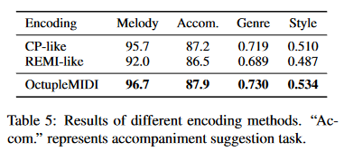

# MusicBERT: Symbolic Music Understanding with Large-Scale Pre-Training

Mingliang Zeng, Xu Tan, Rui Wang, Zeqian Ju, Tao Qin, Tie-Yan Liu

Microsoft Research Asia

[Link to the MusicBERT paper](https://arxiv.org/abs/2106.05630)
[Link to their Github](https://github.com/microsoft/muzic/tree/main/musicbert)

# Table of Contents

- [Introduction: Music is a language](#introduction-music-is-a-language)
- [Paper Overview](#paper-overview)
- [Architecture Overview](#architecture-overview)
- [Critical Analysis](#critical-analysis)
- [Impact](#impact)
- [Future Development After MusicBERT](#future-developments-after-musicbert)
- [Cool Use Case](#cool-use-case)
- [Citations and Related Works](#citations-and-related-works)

# Introduction: Music is a language
Music, much like spoken or written language, has its own structure, syntax, and expressive power. Just as sentences are composed of words with specific grammatical rules, musical compositions are built from sequences of notes that adhere to harmonic, rhythmic, and structural patterns. These musical patterns, while often subconscious to listeners, convey emotions, ideas, and moods in ways that feel both universal and deeply personal.

In the field of Natural Language Processing (NLP), transformers have revolutionized how we process and understand language by analyzing and predicting word patterns. Given the structural similarities between music and language, this raises an intriguing question: 

***If transformers can analyze and generate language, can they also be used to analyze and generate music?***

Music, like text, can be broken down into smaller units (such as notes or chords), processed as sequences, and analyzed for patterns, emotions, and styles. This paper explores the exciting potential of using transformer models, widely successful in NLP, to gain deeper insights into music.
If transformers can understand language by predicting and classifying words, can they do the same for music?

Question 1: What does symbolic music look like?

hint: Think about how you might "read" music.

## Symbolic Music


To understand how transformers can be applied to music, it’s important to distinguish between two types of music data: symbolic and audio. Audio recordings capture sound waves, preserving the nuances of performance, but they are complex and unstructured in a way that’s challenging for direct sequence modeling. Symbolic music, on the other hand, provides a structured representation of musical information, allowing models to process musical patterns more directly, similar to how text tokens are handled in NLP.

The most traditional form of symbolic music is sheet music—a visual score with notes, rhythms, and dynamics that musicians interpret to perform a piece. For digital music processing, however, pianoroll and MIDI formats are more commonly used. Pianoroll representation resembles a grid, with each row representing a pitch and each column representing a time slice, indicating which notes are played at specific moments. MIDI (Musical Instrument Digital Interface) goes even further, encoding not only pitch and rhythm but also attributes like duration, instrument, and velocity (loudness).

These symbolic formats allow us to tokenize music in ways that are compatible with transformer models. MIDI, especially, is highly structured, making it an ideal format for tokenization and sequence modeling—similar to the token-based representation in NLP. By converting music into a structured sequence of tokens, we can apply the same types of computational analysis to music as we do with language.

## Motivating Question

This paper addresses a core research question: Can we use transformers that excel at tasks like sentiment analysis, classification, and fill-in-the-blank predictions in text, to achieve similar results in symbolic music? Transformers in NLP handle tasks such as:

* Sentiment Analysis: Determining the emotional tone of text. In music, could we analyze mood, intensity, or emotional impact?
* Classification: Categorizing text by topic. Could we classify music into genres or styles using similar techniques?
* Fill-in-the-Blank (Masking): Predicting missing words in a sentence. In music, could we predict missing notes in a melody, or even suggest accompaniment?

Applying transformers to symbolic music isn’t a simple task due to music’s unique features, such as pitch, rhythm, and hierarchical structures that differ from natural language. MusicBERT tackles these challenges by adapting the transformer model specifically for symbolic music through OctupleMIDI encoding and a bar-level masking strategy. These innovations help the model understand and predict musical sequences more effectively, making it possible to apply transformer-based tasks to symbolic music in a way that could transform music analysis, generation, and understanding.

# Paper Overview
## How is music encoded?

In the MusicBERT paper, the authors discuss previous attempts to apply NLP techniques to MIDI and symbolic music, specifically highlighting two models:

* REMI (REpresentation of MIcro-timing):

Introduced by Huang and Yang (2020), REMI encodes music in a way that captures temporal information by including bar, position, note duration, chord, and tempo. This model uses multiple tokens to represent various attributes of a single note, such as pitch and timing information, which allows it to capture expressive details. However, REMI's encoding sequence can become quite long, which poses challenges for efficient training and processing with transformers​​.

* CP (Compound Word):

Developed by Hsiao et al. (2021), CP represents musical notes by compressing multiple attributes into a single token, reducing redundancy. The CP encoding combines information about pitch, duration, and velocity into one compound word, thereby shortening the sequence length compared to REMI. This compact approach is more efficient for transformer-based models, though it may lose some expressive details​​.

### How is OctupleMIDI different?


OctupleMIDI introduces a new way of encoding symbolic music by representing each note as a single “octuple” token containing eight distinct elements: time signature, tempo, bar, position, instrument, pitch, duration, and velocity. This format offers several advantages over REMI and CP:

* Reduced Sequence Length: Each note is represented by one octuple token rather than multiple separate tokens. This reduces the sequence length by approximately four times compared to REMI, making it much more manageable for transformers to process long musical pieces.
* Complete Note Representation: Unlike CP, which combines attributes into a single compound token, OctupleMIDI maintains each attribute as a separate component within the octuple. This preserves flexibility and allows the model to learn nuanced relationships between elements (e.g., tempo and duration) without losing context.
* Universal and Adaptable: OctupleMIDI’s format is adaptable across various types of music, supporting diverse genres and structures. It can handle complex music features like time signature changes and varying note durations, making it versatile for a wide range of music applications.


In summary, OctupleMIDI balances the richness of musical information with the efficiency of a shorter sequence, allowing MusicBERT to model complex musical patterns effectively. By addressing the limitations of prior methods, OctupleMIDI provides a streamlined yet comprehensive approach that significantly enhances MusicBERT’s ability to handle symbolic music.

## Bar-Level Masking Strategy

In traditional transformer-based models for NLP, masked language modeling (MLM) is used to train the model by randomly masking certain tokens in a sequence and having the model predict the missing elements. However, applying this token-level masking directly to music presents unique challenges. Music, unlike text, has strong structural dependencies, with patterns that often repeat within a segment, such as a bar. The Bar-Level Masking Strategy introduced in MusicBERT is designed to address these challenges and enable more effective pre-training on symbolic music data.

### Why Token-Level Masking is Insufficient for Music

In symbolic music data, certain attributes, such as time signature, tempo, instrument, and position, often repeat within each bar. For instance, notes within the same bar may share the same tempo, and adjacent notes frequently follow specific harmonic or rhythmic patterns. Traditional token-level masking, which masks individual tokens randomly, can cause information leakage in music data:

* **Repetitive Attributes:** If only one token representing tempo or time signature is masked in a bar, the model can easily infer the masked token based on adjacent, unmasked tokens within the same bar.
* **Harmonic Structure:** Adjacent notes in a bar often follow a predictable harmonic or rhythmic structure. Masking individual tokens may not fully challenge the model to learn these deeper patterns, as it can rely on nearby tokens to predict the masked element.

### How Bar-Level Masking Works

To address these issues, MusicBERT introduces a Bar-Level Masking Strategy that masks all tokens of the same type within a bar (e.g., all pitch tokens or all tempo tokens in a bar). This approach offers several key benefits:

* **Reduces Information Leakage:** By masking all tokens of the same type within a bar, the model cannot simply rely on adjacent tokens to fill in the blanks. Instead, it must learn to understand and predict based on higher-level musical structure and relationships across bars.
* **Encourages Deeper Pattern Learning:** Bar-level masking forces the model to capture contextual information across the entire sequence, as it can no longer rely on within-bar redundancies. This is particularly useful for symbolic music, where understanding longer dependencies (like harmonic progression) is essential.
* **Improves Robustness in Music Prediction:** With bar-level masking, MusicBERT is better trained to predict missing elements even in complex musical compositions, improving its capability in tasks like melody completion or accompaniment suggestion.

## Results of these two methods:



OctupleMIDI encoding outperforms both CP-like and REMI-like encodings across all evaluated tasks: melody completion, accompaniment suggestion, genre classification, and style classification.


Bar-Level Masking strategy outperforms both Random and Octuple masking in all evaluated tasks: melody completion, accompaniment suggestion, genre classification, and style classification.

# Architecture Overview

MusicBERT is based off RoBERTa.

One of the key innovations RoBERTa introduced was dynamic masking during pretraining, where different tokens are masked each time a sequence is passed through the model. This approach allows the model to learn a more comprehensive understanding of each token’s context by seeing it masked in various positions across different training iterations. For MusicBERT, this concept of dynamic masking is adapted into Bar-Level Masking to suit the unique structure of symbolic music data.


Pseudocode for MusicBERT:
```python
# Algorithm: MusicBERT (Encoder-only Transformer for Symbolic Music)

Input: Sequence of musical notes as Octuple tokens
  - Each token contains 8 attributes: TimeSig, Tempo, Bar, Position, Instrument, Pitch, Duration, Velocity
  - Sequence length T
Output: Task-specific predictions (e.g., melody completion, accompaniment suggestion, genre classification)

# Step 1: Initialize Embeddings for Each Element in OctupleMIDI Token
for each token i in the input sequence do:
    # Retrieve each attribute from the Octuple token
    time_sig_i, tempo_i, bar_i, pos_i, instr_i, pitch_i, dur_i, vel_i = token[i]

    # Embed each attribute
    time_sig_embed = Embedding(TimeSig, time_sig_i)
    tempo_embed = Embedding(Tempo, tempo_i)
    bar_embed = Embedding(Bar, bar_i)
    pos_embed = Embedding(Position, pos_i)
    instr_embed = Embedding(Instrument, instr_i)
    pitch_embed = Embedding(Pitch, pitch_i)
    dur_embed = Embedding(Duration, dur_i)
    vel_embed = Embedding(Velocity, vel_i)

    # Concatenate all attribute embeddings to form a complete token embedding
    token_embedding[i] = Concatenate(time_sig_embed, tempo_embed, bar_embed, pos_embed,
                                     instr_embed, pitch_embed, dur_embed, vel_embed)

# Step 2: Add Positional Encoding to Token Embeddings
for i in 1 to T do:
    token_embedding[i] += PositionalEncoding(i)

# Step 3: Apply Bar-Level Masking (Pre-training only)
if training_mode == "pre-training" then:
    for each bar in the sequence do:
        # Randomly mask all tokens of the same type within each bar (e.g., all pitch tokens)
        MaskTokens(bar, type="random attribute type")

# Step 4: Pass Embeddings through Transformer Encoder Layers
for each transformer layer l in range(1, L + 1) do:
    # Self-attention with masked or unmasked tokens
    attention_output = SelfAttention(token_embedding, Mask=Mask)
    # Feed-forward network
    token_embedding = FeedForward(attention_output)

# Step 5: Extract Hidden States for Classification Tasks
hidden_states = token_embedding

# Step 6: Apply Task-Specific Classifiers
for each task in {melody completion, accompaniment suggestion, genre classification, style classification} do:
    if task == "melody completion" then
        output_melody = MelodyCompletionClassifier(hidden_states)
    elif task == "accompaniment suggestion" then
        output_accompaniment = AccompanimentClassifier(hidden_states)
    elif task == "genre classification" then
        output_genre = GenreClassifier(hidden_states)
    elif task == "style classification" then
        output_style = StyleClassifier(hidden_states)

# Step 7: Return Outputs
return output_melody, output_accompaniment, output_genre, output_style
```

MusicBERT Model Configurations:


Results in comparison to other models:


# Critical Analysis

## Strengths
* **Efficient and Compact Encoding (OctupleMIDI)** - MusicBERT’s OctupleMIDI encoding is a major strength, allowing it to process symbolic music with a more compact representation.
* **Tailored Masking Strategy (Bar-Level Masking)** - The Bar-Level Masking strategy sets MusicBERT apart from standard masked language models by addressing music’s repetitive and structured nature.

## Limitations
* Dependence on Pre-Training Data Quality and Diversity:

MusicBERT’s performance heavily relies on the quality and diversity of the symbolic music data used during pre-training. While large datasets like Lakh MIDI and GiantMIDI-Piano provide a good starting point, they may not represent all music genres equally or capture the full spectrum of musical styles, instruments, and cultural nuances.

* Challenges with Modeling Long-Term Musical Structure:

MusicBERT has limitations in modeling very long sequences due to computational and memory constraints. While OctupleMIDI encoding reduces sequence length, long musical pieces with intricate structures (e.g., multi-movement classical symphonies) may still exceed feasible sequence lengths.

# Impact
## Impact on the Field of AI and Music Understanding

MusicBERT has had a substantial impact by bridging the fields of **natural language processing (NLP) and symbolic music understanding**, demonstrating that the powerful transformer architectures successful in NLP can be adapted for music. 

By treating music as a structured language, it answers a longstanding question in AI: **Can language models be successfully applied to non-linguistic, symbolic data?** Through its successful adaptation of NLP models for symbolic music, MusicBERT has provided a clear affirmative answer. This expands AI’s role in creative and analytical processes, not only in music but potentially in other structured domains. Its importance lies in demonstrating that music, as a highly structured form of expression, can be computationally understood and even generated using the same techniques that were transformative in text processing.

# Future Developments after MusicBERT

Here are some things that came after MusicBERT:
* Exploration of Alternative Masking Strategies

MusicBERT’s bar-level masking strategy influenced subsequent research in symbolic music representation by highlighting the importance of aligning masking strategies with musical structure. Future works experimented with different masking techniques, including hierarchical or beat-based masking, to capture more granular rhythmic dependencies and improve model performance on complex, polyphonic music.

* Integration of Audio and Symbolic Representations

Building on MusicBERT’s symbolic focus, recent models have explored integrating symbolic representations (like MIDI) with raw audio features. This multimodal approach allows models to leverage both the structured symbolic data and the nuanced dynamics of audio, bridging the gap between music notation and real-world audio signals.

* Cross-Modality Training

Inspired by MusicBERT, some research expanded the architecture to handle additional data types, such as lyrics or visual inputs from music videos, using cross-modality training. This approach allows models to interpret and generate music within richer multimedia contexts.

* Refining Encoding Schemes for Better Expressiveness

OctupleMIDI demonstrated an efficient way to tokenize music, but limitations in capturing expressive details (like dynamics and micro-timing) led to further experimentation with extended tokenization schemes. Researchers have proposed adding additional elements to the tokens to handle finer temporal variations and dynamic expressions, enabling richer musical outputs.

* Adapting to Diverse and Culturally Varied Datasets

New models inspired by MusicBERT aim to generalize better by training on culturally diverse datasets, allowing for applications that recognize and generate music across a wide variety of musical forms and styles. Building on MusicBERT’s architecture, some research has focused on genre-specific fine-tuning, tailoring the model to understand and generate music within particular styles, such as jazz improvisation or electronic dance music, where stylistic nuances are key.

* Incorporating Higher-Level Music Theory and Structure

MusicBERT’s focus on shorter, structurally repetitive elements within bars encouraged further exploration of handling larger, hierarchical musical structures. Newer models have incorporated approaches like hierarchical transformers to better represent long-term dependencies, allowing for the generation of compositions that maintain thematic coherence over extended sequences.

# Cool Use Case

[midiformers Github link](https://github.com/tripathiarpan20/midiformers)

# Citations and Related Works

Ren, Y., Zhu, J., Zhang, X., Sun, M., & Liu, J. (2021). MusicBERT: Symbolic Music Understanding with Large-Scale Pre-Training. arXiv preprint arXiv:2106.05630.
[Link to Paper](https://arxiv.org/abs/2106.05630)

Liu, Y., Ott, M., Goyal, N., Du, J., Joshi, M., Chen, D., Levy, O., Lewis, M., Zettlemoyer, L., & Stoyanov, V. (2019). RoBERTa: A robustly optimized BERT pretraining approach. arXiv preprint arXiv:1907.11692.
[Link to Paper](https://arxiv.org/abs/1907.11692)

Huang, Y.-S., & Yang, Y.-H. (2020). Pop Music Transformer: Beat-based Modeling and Generation of Expressive Pop Piano Compositions. In Proceedings of the 28th ACM International Conference on Multimedia (MM '20) (pp. 1180–1188). ACM.
[Link to Paper](https://arxiv.org/abs/2002.00212)
